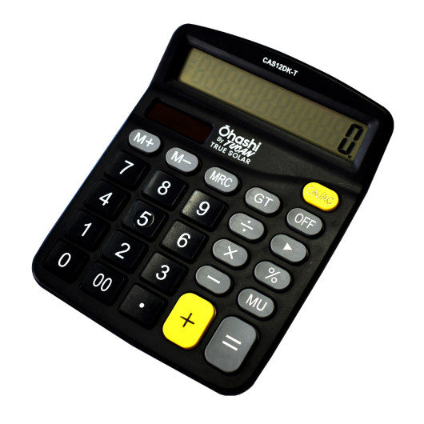
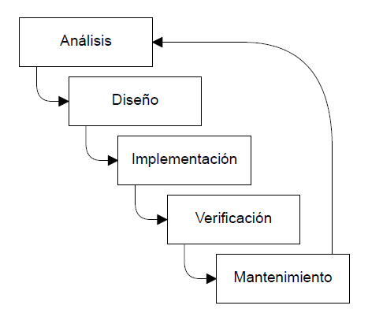
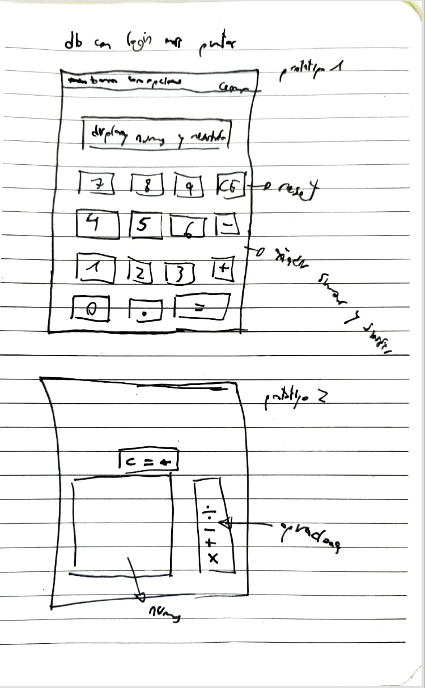
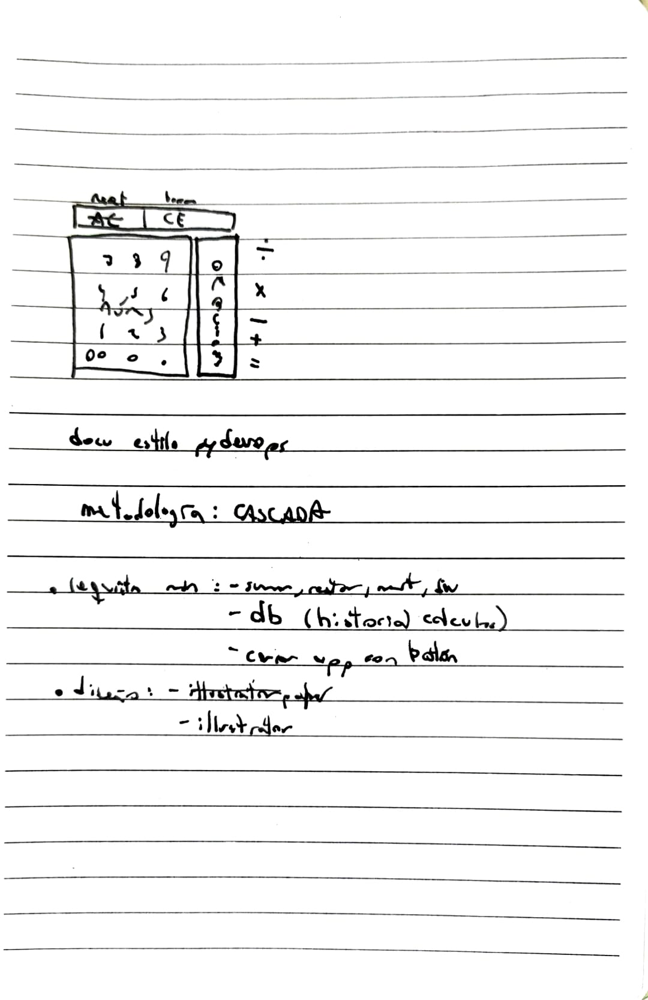
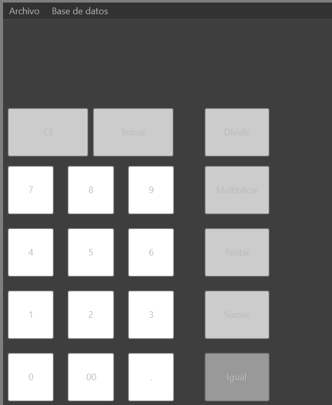
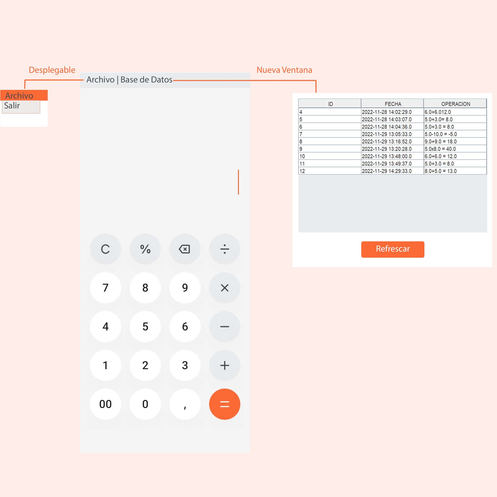

# **Practica1: Calculadora**

## **Introducción**

En este proyecto vamos a relizar una calculadora funcional con **Java Swing**. El IDE elegido para el desarrollo es **NetBeans**. 

El enfoque que he tomado para el desarrollo es el de realizar una calculadora simple que pueda utilizar cualquier usuario, una calculadora *"standard"* o clásica. 

Podemos realizar calculos sencillos (versión 0.1). El uso es similar al de una clásica calculadora física. Estas calculadoras funcionan de la siguiente manera:
- El usuario inserte el primer número que desea calcular
- Al elegir que tipo de operación realizar el número se "borra" de la pantalla. Permitiéndonos así el segundo número
- Al pulsar la tecla igual se realiza la operación

Estas son las funcionalidades principales y el objetivo de este proyecto. Más adelante explicaré el proceso de desarrollo de código, las decisiones que he tomado, la estructura y la funcionalidad de los métodos escritos. 

## **Metodología de desarrollo**

He elegido como metodología cascada. ¿Por qué cascada y no espiral? He elegido esta metodología ya que es un proyecto corto con claras etapas de desarrollo. La otra metodología que me había planteado era espiral, pero esta está más enfocada a grandes proyectos. Este trabajo no requiere de un largo nivel de iteraciones.

¿En qué consiste la metodología de desarrollo en cascada? Es una metodología de desarrollo de tipo tradicional. Se basa en seguir unas
fases de desarrollo una después de otra. Su nombre viene de que las diferentes fases se ponen una encima de otra y se empieza desde la de arriba, y luego se va ejecutando cada una de arriba a abajo, recordando al flujo de una cascada.
Se suele usar en entornos de industria y construcción, donde normalmente es muy difícil y caro cambiar algo una vez que este implementado. En esta app es conveniente dado el tiempo de desarrollo de tres semanas. Así tengo un enfoque más directo, logrando así finalizar la app en el plazo otorgado.

## Fases del Modelo en Cascada

### ***Análisis***

En la fase de análisis (y/o requisitos), se preparan y describen los objetivos, presupuesto, tiempo de
entrega del proyecto, herramientas, riesgos, etc... Todo esto debe estar muy detallado y comprendido
por los desarrolladores, ya que una vez que se haya empezado a trabajar con el modelo, no se podrá
cambiar en el medio del ciclo de desarrollo. 

En este caso los objetivos los marca el PDF de la práctica. Con objetivos primordiales y extras.

### ***Diseño***

En esta fase es cuando tenemos que diseñar la estructura del software, identificando las varias funciones
que va a tener nuestro programa. También deberemos identificar sus elementos y la relación que tiene el uno con el otro.

### ***Implementación***

En la fase de implementación deberemos pasar a código los elementos, relaciones y funciones establecidas en la tapa anterior. El lenguaje, tecnologías, paradigmas y técnicas se han establecido en la fase de análisis.

### ***Verificación***

Solo se entra en la fase de verificación cuando el software ya cumple su objetivo. Osea que esta fase sirve para refactorizar código, optimizar algoritmos y detectar y remover bugs y posibles vulnerabilidades. También es la fase donde el proyecto se evaluá con los objetivo iniciales y se presenta al cliente final.

### ***Mantenimiento***

En la fase de mantenimiento es donde solo esperamos para correcciones de problemas nuevos y la introducción de otras funcionalidades del software. En el caso de tener que modificar el software, se entraría en un nuevo ciclo de cascada que empieza de cero con los nuevos objetivos.

## **Interfaz**

Para el diseño de la interfaz he seguido las siguientes fases.

### ***Sketch***

En la fase de Sketch he realizado varios bocetos a papel y boli. He ido haciendo bocetos hasta llegar a un diseño viable, limpio, comprensible y moderno.

La inspiración, por llamarlo de alguna manera, para el diseño me la dió la calculadora de mi OnePlus. Esta calculadora tiene un diseño sencillo, intuitivo y elegante.

### ***Wireframe***

Un wireframe es una ilustración bidimensional de la interfaz de una página o una aplicación que se centra específicamente en la asignación de espacio y priorización del contenido, las funcionalidades disponibles, y los comportamientos deseados.

En el desarrollo de esta app no realicé ningún wireframe en alguna app, directamente hice el diseño de la calculadora en un JForm, utilizando labels, buttons y demás a modo de wireframe. 

### ***MockUp***

El MockUp una composición gráfica completa que ha utilizado el wireframe como plantilla introduciendo todos los elementos gráficos y visuales, convirtiéndose así en un modelo a escala de un producto que se utiliza para demostrar y probar un diseño. El mockup es un medio de representación de la apariencia del producto, y muestra los fundamentos de su funcionalidad. Los MockUp incluyen los detalles visuales, tales como colores, tipografía, etc., y son generalmente estáticas. Al observar un mockup, se debe tener una buena idea de cómo se verá el producto final y una idea aproximada de cómo podría funcionar (incluso si las funciones aún no se han desarrollado).

La página principal de la aplicación es la calculadora. El usuario dispondrá de los botones necesarios para realizar cálculos básicos.

Sobre el cuadro de botones el usuario verá los datos que está introduciendo. Cuando inserté un operador la pantalla se pondrá en blanco, permitiendo así insertar el otro valor deseado en el cálculo.

En la parte superior tenemos la barra de tareas. En ella el usuario puede hacer click en las dos opciones mostradas en la imagen. Si hace click en ***Archivo*** de desplegará un menú con la opción ***Salir***. Al hacer click en Base de Datos.