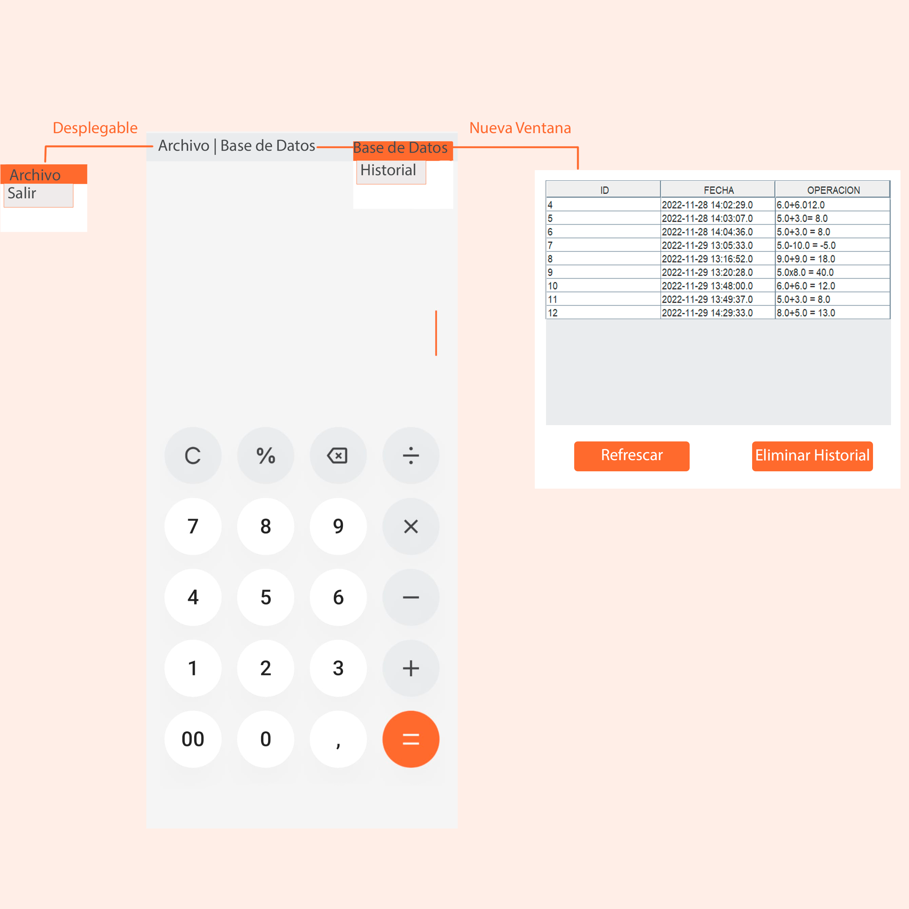
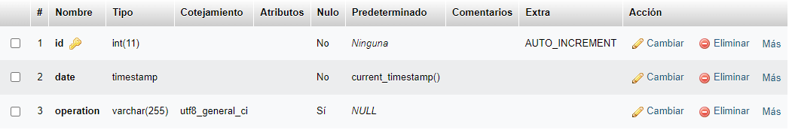

# **Practica1: Calculadora**

## **Introducción**

En este proyecto vamos a relizar una calculadora funcional con **Java Swing**. El IDE elegido para el desarrollo es **NetBeans**. 

El enfoque que he tomado para el desarrollo es el de realizar una calculadora simple que pueda utilizar cualquier usuario, una calculadora *"standard"* o clásica. 


Podemos realizar calculos sencillos (versión 0.1). El uso es similar al de una clásica calculadora física. Estas calculadoras funcionan de la siguiente manera:
- El usuario inserte el primer número que desea calcular
- Al elegir que tipo de operación realizar el número se "borra" de la pantalla. Permitiéndonos así el segundo número
- Al pulsar la tecla igual se realiza la operación

Estas son las funcionalidades principales y el objetivo de este proyecto. Más adelante explicaré el proceso de desarrollo de código, las decisiones que he tomado, la estructura y la funcionalidad de los métodos escritos. 

## **Metodología de desarrollo**


He elegido como metodología cascada. ¿Por qué cascada y no espiral? He elegido esta metodología ya que es un proyecto corto con claras etapas de desarrollo. La otra metodología que me había planteado era espiral, pero esta está más enfocada a grandes proyectos. Este trabajo no requiere de un largo nivel de iteraciones.

¿En qué consiste la metodología de desarrollo en cascada? Es una metodología de desarrollo de tipo tradicional. Se basa en seguir unas
fases de desarrollo una después de otra. Su nombre viene de que las diferentes fases se ponen una encima de otra y se empieza desde la de arriba, y luego se va ejecutando cada una de arriba a abajo, recordando al flujo de una cascada.
Se suele usar en entornos de industria y construcción, donde normalmente es muy difícil y caro cambiar algo una vez que este implementado. En esta app es conveniente dado el tiempo de desarrollo de tres semanas. Así tengo un enfoque más directo, logrando así finalizar la app en el plazo otorgado.

## Fases del Modelo en Cascada


### ***Análisis***

En la fase de análisis (y/o requisitos), se preparan y describen los objetivos, presupuesto, tiempo de
entrega del proyecto, herramientas, riesgos, etc... Todo esto debe estar muy detallado y comprendido
por los desarrolladores, ya que una vez que se haya empezado a trabajar con el modelo, no se podrá
cambiar en el medio del ciclo de desarrollo. 

En este caso los objetivos los marca el PDF de la práctica. Con objetivos primordiales y extras.

### ***Diseño***

En esta fase es cuando tenemos que diseñar la estructura del software, identificando las varias funciones
que va a tener nuestro programa. También deberemos identificar sus elementos y la relación que tiene el uno con el otro.

### ***Implementación***

En la fase de implementación deberemos pasar a código los elementos, relaciones y funciones establecidas en la tapa anterior. El lenguaje, tecnologías, paradigmas y técnicas se han establecido en la fase de análisis.

### ***Verificación***

Solo se entra en la fase de verificación cuando el software ya cumple su objetivo. Osea que esta fase sirve para refactorizar código, optimizar algoritmos y detectar y remover bugs y posibles vulnerabilidades. También es la fase donde el proyecto se evaluá con los objetivo iniciales y se presenta al cliente final.

### ***Mantenimiento***

En la fase de mantenimiento es donde solo esperamos para correcciones de problemas nuevos y la introducción de otras funcionalidades del software. En el caso de tener que modificar el software, se entraría en un nuevo ciclo de cascada que empieza de cero con los nuevos objetivos.

## **Interfaz**

Para el diseño de la interfaz he seguido las siguientes fases.


### ***Sketch***

En la fase de Sketch he realizado varios bocetos a papel y boli. He ido haciendo bocetos hasta llegar a un diseño viable, limpio, comprensible y moderno.


La inspiración, por llamarlo de alguna manera, para el diseño me la dió la calculadora de mi OnePlus. Esta calculadora tiene un diseño sencillo, intuitivo y elegante.

### ***Wireframe***

Un wireframe es una ilustración bidimensional de la interfaz de una página o una aplicación que se centra específicamente en la asignación de espacio y priorización del contenido, las funcionalidades disponibles, y los comportamientos deseados.

En el desarrollo de esta app no realicé ningún wireframe en alguna app, directamente hice el diseño de la calculadora en un JForm, utilizando labels, buttons y demás a modo de wireframe. 


### ***MockUp***

El MockUp una composición gráfica completa que ha utilizado el wireframe como plantilla introduciendo todos los elementos gráficos y visuales, convirtiéndose así en un modelo a escala de un producto que se utiliza para demostrar y probar un diseño. El mockup es un medio de representación de la apariencia del producto, y muestra los fundamentos de su funcionalidad. Los MockUp incluyen los detalles visuales, tales como colores, tipografía, etc., y son generalmente estáticas. Al observar un mockup, se debe tener una buena idea de cómo se verá el producto final y una idea aproximada de cómo podría funcionar (incluso si las funciones aún no se han desarrollado).



La página principal de la aplicación es la calculadora. El usuario dispondrá de los botones necesarios para realizar cálculos básicos.

Sobre el cuadro de botones el usuario verá los datos que está introduciendo. Cuando inserté un operador la pantalla se pondrá en blanco, permitiendo así insertar el otro valor deseado en el cálculo.

En la parte superior tenemos la barra de tareas. En ella el usuario puede hacer click en las dos opciones mostradas en la imagen. Si hace click en ***Archivo*** de desplegará un menú con la opción ***Salir***. Al hacer click en ***Base de Datos*** se desplegaré un menú con la opción ***Historial***. Al hacer click en Historial se nos barirá una nueva ventana en la que veremos nuuestra base de datos. También podemos interactuar con ella. Al hacer click derecho sobre una fila podemos eliminar esa entrada. Al hacer click en refrescar actualizaremos la tabla que vemos. Y, por último, al hacer click en **Eliminar Registro** borraremos el historial al completo.

He elegido la paleta de color: *NARANJA* y *tonalidades de BLANCO* ya que son colores fáciles de distinguir y no son molestos a la vista. Son colores cálidos y agradables a la vista, sin cambios drásticos que desconcentren al usuario y que le ahagn olvidar "por qué ha abierto la calculadora".


### ***Prototipo***

Un prototipo es un modelo (representación, demostración o simulación) fácilmente ampliable y
modificable de un sistema planificado, probablemente incluyendo su interfaz y su funcionalidad de
entradas y salidas.

En este caso hice un prototipo con los botones standard de JSwing. Haciendo el código necesario para cumplir con la funcionalidad y navegación de la app.


## **Código**

Voy a explicar la estructura de directios del proyecto y cómo están organizados los archivos. Explicando también la funcionalidad del código que albergan dichas clases.


En el package **BaseDatos** tengo la clase ***ConexionMySQL.java***. Esta clase es la encargada de realizar la conexión a la Base de Datos.

``` java
package BaseDatos;

import java.sql.*;
import javax.swing.JOptionPane;

    public class ConexionMySQL { //variables para conectarse a la db
    public String bd = "calculadoralapini";
    public String login = "root";
    public String password = "";
    public String url = "jdbc:mysql://localhost/" + bd;

    public Connection connect() {
        Connection link = null;
        try {
            Class.forName("com.mysql.jdbc.Driver");
            link = DriverManager.getConnection(this.url, this.login, this.password);
            
        } catch (Exception e) {
            JOptionPane.showMessageDialog(null , e);
        }
        return link;
    }
}
```
En el package **practica1_calculadora** encontramos lo siguiente:

- Clase NewJFrame. Esta clase es la contenedora del código para hacer funcional el proyecto. Dentro están los botones con sus funcionalidades y otras funciones para realizar los cálculos. Explicaré las funciones más importante o clave, no todas ya que el código es extenso. 


``` java
import com.mysql.jdbc.Statement;
import practica1_calculadora.circleButton.CircleButtonOrange;

import java.awt.Color;
import java.awt.HeadlessException;
import java.awt.Toolkit;
import java.sql.Connection;
import java.sql.PreparedStatement;
import java.sql.SQLException;
import java.sql.ResultSet;
import java.util.regex.Matcher;
import java.util.regex.Pattern;
import javax.swing.ImageIcon;
import javax.swing.JOptionPane;
import javax.swing.SwingConstants;
import javax.swing.table.DefaultTableModel;
import practica1_calculadora.circleButton.CircleButtonGrey;

/**
 *
 * @author alela
 */
public class NewJFrame extends javax.swing.JFrame {

    private double firstNum; //primer numero para hacer los calculos
    private double secondNum; //segundo numero para hacer los calculos
    private double total; //total del calculo de firstNum y secondNum
    
    private String operator; //guarda el operador que se utiliza en la operacion
    private String totalResult; //resultado total para el label
    
    String SQL = new String(); //variable para las futuras sentencias SQL
    DefaultTableModel model; //tabla que contendrá los objetos de la db
    String[] register = new String[3]; //las tres columnas de la tabla
          
    public NewJFrame() {
        initComponents();
        queryOperations();
        this.setIconImage(Toolkit.getDefaultToolkit().getImage(NewJFrame.class.getResource("/practica1_calculadora/images/iconCalc.png"))); //cambia el icono de la app
    }

```
La función **queryOperations()** hace una consulta a la base de datos. Recoge los objetos y los insertas en la tabla que hemos declarado antes.

``` java
public void queryOperations() {  //Hace una consulta a la db. Recoge los objetos de la db y los inserta en una tabla
        String[] operations = {"ID", "FECHA", "OPERACION"};
        model = new DefaultTableModel(null, operations);
        ConexionMySQL cc = new ConexionMySQL();
        Connection cn = (Connection) cc.connect();
        
        SQL = "SELECT id, date, operation from operations";
        
        try{
            Statement st = (Statement) cn.createStatement();
            ResultSet rs = st.executeQuery(SQL);
            while(rs.next()) {
                register[0] = rs.getString("id");
                register[1] = rs.getString("date");
                register[2] = rs.getString("operation");
                model.addRow(register);
            }
       
            tblRegister.setModel(model);
        
        }catch (SQLException ex) {
            JOptionPane.showMessageDialog(null, ex);
        }
    }
```

Los eventos **actionPerformed()** de los operadores siguen el mismo patrón. Al pulsar un botón operador asignamos a la variable operador el símbolo que hemos pulsado. Parseamos el texto a un double y borramos el texto para que el usuario puede insertar el segundo operador.

``` java
private void btnSumActionPerformed(java.awt.event.ActionEvent evt) {                                       
       emptyString();
       operator = "+";
       firstNum = Double.parseDouble(etiResultado.getText());
       etiResultado.setText("");
       resetColor();
    }
```

La función **emptyString()** mira si el texto del label está vacío. Hay que poner un número antes de usar un operador. Si no se ha insertado ningún número la calculadora dará Error por pantalla al usuario.

``` java
    private void emptyString(){ //mira si la etiqueta está vacia. Si está vacía escribe error en la etiqueta.
        String text = etiResultado.getText();
        if (text.isEmpty()) {
        etiResultado.setText("Error");
        errorColor();
        }
    }
```


La función **ValidateString()** verifica mediante una expresión regular si el String que le hemos pasado a la calculadora es válido o no. Si no es válido la pantalla se pondrá en rojo.

``` java
    private boolean ValidateString() {
        String regex = "^[\\d\\+\\/\\*\\.\\- \\(\\)]*$"; //regex valida que solo haya digitos y operandos
        Pattern pat = Pattern.compile(regex);
        Matcher mat = pat.matcher(etiResultado.getText());
        
        if(mat.find()) {
        System.out.println("Expresión validada");
        return true;
        } else {
            System.out.println("Inserte un string válido");
            errorColor();
            return false;}
    }
```
La función **calculate()** llama a las funciones ValidateString() y emptyString(). Si está todo validado recoger los datos actuales que hay en el label y los parsea a un double en la variable seconNum. Creo un switch que selecciona un case u otro según el valor de la variable operador. Una vez finalizada la operación escribe el resultado en la etiqueta y lo inserta en la base de datos. Dicha operación la llevará acabo el actionPerformed del botón igual.

``` java
private void calculate(){ //funcion para realizar los calculos
        ValidateString();
        emptyString();
        secondNum = Double.parseDouble(etiResultado.getText());
        switch(operator) {  //maquina de estados que realiza un cálculo u otro segun el valor de operator
            case "+":
                total = firstNum + secondNum;
                totalResult = String.valueOf(total);
                break;
            case "-":
                total = firstNum - secondNum;
                totalResult = String.valueOf(total);
                break;
            case "x":
                total = firstNum * secondNum;
                totalResult = String.valueOf(total);
                break;
            case "÷":
                total = firstNum / secondNum;
                totalResult = String.valueOf(total);
                break;
            case "%":
                total = (firstNum / 100) * secondNum;
                totalResult = String.valueOf(total);
        }
        etiResultado.setText(totalResult);
        InsertSQL();
    } 
```
La función **InserSQL()** inserta el total de la operación anterior en la base de datos. Los valores de la id y date son null ya que configuré la base de datos para que la id fuera auto incremental y la fecha fuera un current time.

``` java
    private void InsertSQL() { //inserta datos en la db
        ConexionMySQL cc = new ConexionMySQL();
        Connection cn = cc.connect();
        
        String vId = null; //le asigno el valor null ya que la db lo rellena automaticamente
        String vDate = null; //le asigno el valor null ya que la db lo rellena automaticamente
        String vResult = String.valueOf(firstNum) + operator + String.valueOf(secondNum) + " = " + etiResultado.getText(); //string que se va a insertar en la col resultado
        
        String SQL = "INSERT INTO operations(id, date, operation) VALUES (?, ?, ?)"; //comando SQL
        
        try {
            PreparedStatement pst = cn.prepareStatement(SQL, Statement.RETURN_GENERATED_KEYS);
            
            pst.setString(1, vId);
            pst.setString(2, vDate);
            pst.setString(3, vResult);
         
            int n = pst.executeUpdate();
            if (n > 0) {
                etiResultado.setOpaque(true);
                etiResultado.setBackground(Color.green.brighter());
            }
        } catch (SQLException ex) {
            JOptionPane.showMessageDialog(null, ex);
            System.out.println(ex);
        }
    
```
La función **iteEliminarActionPerformed(java.awt.event.ActionEvent evt)** elimina la fila de la base de datos que el usuario desee. Con click derecho activa el popUp con la opción "eliminar".
``` java
private void iteEliminarActionPerformed(java.awt.event.ActionEvent evt) {                                            
        ConexionMySQL cc = new ConexionMySQL(); //elimina una fila de la base de datos
        Connection cn = cc.connect();

        int rowSel;
        String vId;

        try {
            rowSel = tblRegister.getSelectedRow();
            if (rowSel == -1) {
                JOptionPane.showMessageDialog(null, "No se ha seleccionado ninguna fila");
            } else {
                DefaultTableModel model = (DefaultTableModel) tblRegister.getModel();
                vId = (String) model.getValueAt(rowSel, 0);
                String vSQL = "DELETE from operations WHERE id='" + vId + "'";
                try {
                    PreparedStatement pst = cn.prepareStatement(vSQL);
                    int n = pst.executeUpdate();
                    if (n > 0) {
                        JOptionPane.showMessageDialog(null, "Eliminación satisfactoria");
                        queryOperations();
                    }
                } catch (SQLException ex) {
                    JOptionPane.showMessageDialog(null, ex);
                }
                System.out.println(vId);
            }
        } catch (HeadlessException ex) {
            JOptionPane.showMessageDialog(null, ex);
        }
    }      
```
La función **btnEliminarTodoActionPerformed(java.awt.event.ActionEvent evt)** elimina todo el contenido de la base de datos.

``` java
  private void btnEliminarTodoActionPerformed(java.awt.event.ActionEvent evt) {
        ConexionMySQL cc = new ConexionMySQL(); //elimina todos los datos de la db
        Connection cn = cc.connect();
        
        String vSQL = "TRUNCATE TABLE operations";
        
        try {
            PreparedStatement pst = cn.prepareStatement(vSQL);
            pst.execute();
            queryOperations();
        } catch (SQLException ex) {
            JOptionPane.showMessageDialog(null, ex);
        }
    }
```


En el package circleButton tengo las clases que modifican las propiedas del JButton para así poder hacerlo redondo y darle color. He tenido que crear una clase por cada color que he querido añadir. El código es de la web [happycoding](https://happycoding.io/tutorials/java/swing/circle-button).

``` java
public class CircleButton extends JButton{

	private boolean mouseOver = false;
	private boolean mousePressed = false;

	public CircleButton(String text){
		super(text);
		setOpaque(false);
		setFocusPainted(false);
		setBorderPainted(false);

		MouseAdapter mouseListener = new MouseAdapter(){

			@Override
			public void mousePressed(MouseEvent me){
				if(contains(me.getX(), me.getY())){
					mousePressed = true;
					repaint();
				}
			}

			@Override
			public void mouseReleased(MouseEvent me){
				mousePressed = false;
				repaint();
			}

			@Override
			public void mouseExited(MouseEvent me){
				mouseOver = false;
				mousePressed = false;
				repaint();
			}

			@Override
			public void mouseMoved(MouseEvent me){
				mouseOver = contains(me.getX(), me.getY());
				repaint();
			}
		};

		addMouseListener(mouseListener);
		addMouseMotionListener(mouseListener);		
	}

	private int getDiameter(){
		int diameter = Math.min(getWidth(), getHeight());
		return diameter;
	}

	@Override
	public Dimension getPreferredSize(){
		FontMetrics metrics = getGraphics().getFontMetrics(getFont());
		int minDiameter = 10 + Math.max(metrics.stringWidth(getText()), metrics.getHeight());
		return new Dimension(minDiameter, minDiameter);
	}

	@Override
	public boolean contains(int x, int y){
		int radius = getDiameter()/2;
		return Point2D.distance(x, y, getWidth()/2, getHeight()/2) < radius;
	}

	@Override
	public void paintComponent(Graphics g){

		int diameter = getDiameter();
		int radius = diameter/2;

		if(mousePressed){
			g.setColor(Color.GRAY);
		}
		else{
			g.setColor(Color.WHITE);
		}
		g.fillOval(getWidth()/2 - radius, getHeight()/2 - radius, diameter, diameter);

		if(mouseOver){
			g.setColor(Color.LIGHT_GRAY);
		}
		else{
			g.setColor(Color.WHITE);
		}
		g.drawOval(getWidth()/2 - radius, getHeight()/2 - radius, diameter, diameter);

		g.setColor(Color.white.darker());
		g.setFont(getFont());
		FontMetrics metrics = g.getFontMetrics(getFont());
		int stringWidth = metrics.stringWidth(getText());
		int stringHeight = metrics.getHeight();
		g.drawString(getText(), getWidth()/2 - stringWidth/2, getHeight()/2 + stringHeight/4);
	}
}
```

## **Base de Datos**

La base de datos la lanzo en localhost con Xampp. Es una base de datos relacional mySQL. Para esta base de datos solo necesito una tabla.  



Expliación de los tres campos:

- La **id** es la ***PRIMARY KEY*** de esta tabla. No puede ser null y por cada objeto que se sube se auto incrementa.
- **date** va a guardar la fecha en la que se ha realizado la operación. No puede ser null y coge la hora local a la que se sube a la base de datos - ***current_timestamp()***.
- **operation** es el resultado de la operación realizada. Es un varchar ya que va a guardar la operación completa, incluyendo símbolos.

## **Problemas**

Al principio planteé el desarrollo de la calculadora con expresiones regulares. Así lo documenté al principio. 

> Voy a utilizar expresiones regulares para realizar los cálculos. Con esta expresión capturo todo el string anterior al símbolo operador. El desarrollo de la calculadora utilizando expresiones regulares aumenta en gran manera el tiempo de desarrollo de la app.

Al final pivoté y terminé utilizando las expresiones regulares para validar los datos de entrada.

Me planteé también el uso de librerias Maven para así no tener que escribir código innecesario. Al buscar información ví que importar librerias Maven en Ant llevaría más tiempo que el desarrollo de alguna que otra función. Así que quedó descartado.

También quise implementar mis botones propios hechos con Photoshop. No me gustaba el no poder hacer el botón completamente redondo, así que terminé haciendo los botones por código. 

Por último he querido implementar la concatenación de operaciones. Al final no he podido hacerlo ya que me daba errores de cálculos. Una manera de hacerlo sería almacenando el input en un array y que, a la hora de calcular, se "iterase" el array para así poder concatenar. Esto habría supuesto modificar todo el código.